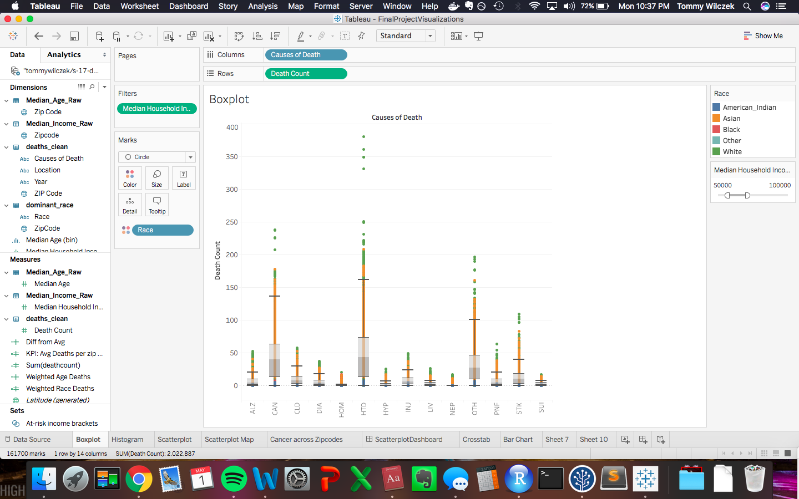
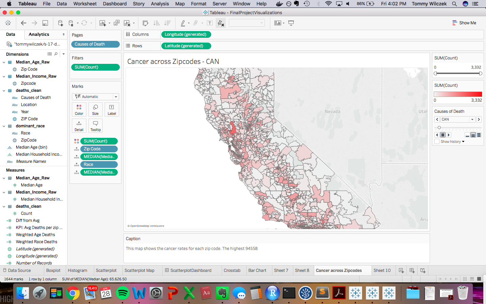
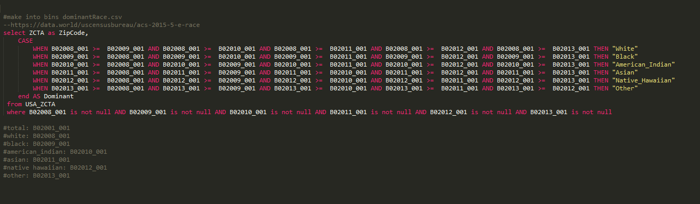

<center></center>

#**Introduction**
Our goal for this project was to create interesting visualization showing correlations between causes of death and the demographic trends in the zip codes of California. 

In order to do so we are cleaning dirty Zip code data from the US Census as well as zip code data corresponding to cause of death. These data sets are available on data.world and were joined using Tableau and R, which we used to produce the visualizations we present in this document.

The following links refer to the census data used for out visualizations.

Median Income data was taken from the following link to the US Census Data in data.world:
https://data.world/uscensusbureau/acs-2015-5-e-income

Median Age data was taken from the following link to the US Census Data in data.world:
https://data.world/uscensusbureau/acs-2015-5-e-agesex

Dominant Race data was taken from the following link to the US Census Data in data.world:
https://data.world/uscensusbureau/acs-2015-5-e-race

#**R Configuration**
Below we display our sessionInfo().

```{r sessionInfo}
sessionInfo(package=NULL)
```

#**Data Summary**
The following heads and summaries demonstrate the data that will be joining via data.world in our queries when using shiny. This data will also be joined in tableau for the corresponding visualizations.  


#**Processing the Data**
The csv files containing our data of interest were passed through individual ETL files for cleaning. In this process spaces are included between upper and lower cased letters and ampersands are changed to the word "and".These subtleties among others are done to effectively upload the data files to data.world. Because our data did not require much "cleaning" or renaming of columns, we did not need to include in depth code in the ETL file. We used many "cookie-cutter" ETL files to clean the many files we used for our joins. These files include "ETL_median_age.R, ETL_dominant_race.R, ETL_median_income.R" Below is a source or link to one of our ETL files. 

Below is a source of our etl file used to clean our dominant race file,
```{r echo=FALSE}
 source("../01Data/ETL_dominant_race.R")
```

The following screen shot shows some of the code used to clean the dominant race file.
```{r, out.width = "1000px"}
knitr::include_graphics("../01Data/dominantRace.png")
```


#**Tableau Visualizations Steps**

##**Step 1 - Retrieving our Data**
We pulled in 2 grouped data sets from our project that originated from the US Census (Median_Income_Raw.csv, and Median_Age_Raw.csv). In addition, we grouped a set from race deomgraphics Census data to create the domianat_race.csv. In order to create this file, we queried the orginal census data in a way we could define the domianant race in each zip code (sql commands at the bottom of the presentation).A new column was added to the data set indicating the most represented race in each zip code. We used the data.world connector to retrieve everything from our final project site on data.world. This is where we also pulled the Cause of Death data set. Finally we pulled in a data file that contained California zipcodes, cause of death, and the count of each type that fell in that category. These files were inner joined on ZIP Code to analyze cause and count of death to median income, dominant race, and median age in each ZIP Code.

```{r, out.width = "1000px", echo=FALSE}
knitr::include_graphics("../03Visualizations/join.png")
```

#**Boxplot Visualization Steps**


##**Step 1 - Boxplot Overview**
In order to create our box plot we set causes of deaths as the columns which can be seen along the x-axis of the plot. The row are set as the count of deaths as seen on the y-axis of the plot. Each zip code has a corresponding point on the boxplot for each cause of death. We set dominant race as the color of the points in the plot. Therefore, the color of each point depends on each zip code's dominant race. The boxes along each column mark the 25th to 75th percentile of counts of deaths per zip code for each cause. The whiskers mark the highest and lowest count values considered to not be outliers. 

##**Step 2 - Filter**
We added a filter to this boxplot in order to define the range of the median incomes of the zipcodes displyed. 

```{r, out.width = "1000px", echo=FALSE}
knitr::include_graphics("../03Visualizations/Tableau_Screenshots/Boxplot1.png")

knitr::include_graphics("../03Visualizations/Tableau_Screenshots/Boxplot3.png")

```
This observation seems relatively odd. If even just looking at the general death rate we see that it starts high, goes down, then goes back up again as income is steadily increasing. If you are only operating under the premise that more income means better healthcare/lifestyle which means greater longevity this seems counter intuitive. However if you consider who is making the higher income amounts it makes more sense. 

<center></center>

##**Histogram Visualization Steps**
```{r, out.width = "1000px", echo=FALSE}
knitr::include_graphics("../03Visualizations/Tableau_Screenshots/2.png")

```
##**Scatter Plot Visualization Steps**
```{r, out.width = "1000px", echo=FALSE}
knitr::include_graphics("../03Visualizations/Tableau_Screenshots/3.png")
knitr::include_graphics("../03Visualizations/Tableau_Screenshots/5.png")

```

##**Crosstab Visualization Steps**

###**Step 1 - Table Caculations**

The two table calculation pills we included in our Tableau file were "Calculated Diff from Avg" and "Calculated Weighted Diff from Avg." Reference lines were also included in our project. This can be seen in the "Race Table Calculations" visualization. In this case, reference lines were used to depict an average count of death by race for each cause of death. 

```{r, out.width = "1000px", echo=FALSE}
knitr::include_graphics("../03Visualizations/Tableau_Screenshots/6.png")
```

##**Barchart Visualization Steps**
```{r, out.width = "1000px", echo=FALSE}
knitr::include_graphics("../03Visualizations/Tableau_Screenshots/7.png")
knitr::include_graphics("../03Visualizations/Tableau_Screenshots/9.png")
knitr::include_graphics("../03Visualizations/Tableau_Screenshots/8.png")
```

###**Step 1 - Retrieving our Data**
We pulled in 3 data sets from our project that originated from the US Census (median_income.csv, median_age.csv, and dominant_race.csv).We found that some columns in these data sets had to be grouped, so we included our SQL code at the bottom of the project that describes how we created bins for ages, incomes, and dominant races.For this same reason, we did not pull from the Census Bureau's data. Instead, we used the data.world connector to retrieve everything from our project 6 site on data.world. This is where we also pulled the Cause of Death data set. These files were inner joined on ZIP Code to analyze cause and count of death to median income, dominant race, and median age in each ZIP Code.

###**Step 2 - Barchart Overview**
We created barcharts between either median income, dominant race, or median age (one blue) and cause of death (second blue) in the row slot. This then lists all the causes of death and within each cause of death lists a row for either median age, or dominant race.  A sum of the count of deaths (green) was added as the column of the barcharts. With this count we can compare the number of people dying of a certain cause of death across zip codes of different median ages (for example). Nonetheless, we considered that certain races, and ages were over represented in our data. Therefore, we created a calculated field to add to our column slot named Weighted Race/Age Deaths which will be described in the following bullet. This calculated field allows us to recognize which populations are more likely to die of certain causes than predicting from a raw count of deaths.  


###**Step 3 - Calculated Fields**
Furthermore, as mentioned previously we created three calculated field producing a  Weighted count of Deaths for income, age, and dominant race. To illustrate the process we can take the deaths by race barchart as an example. The calculated field takes the count of deaths in a zip code dominanted by a certain race due to a certain cause and divides it by the total count of deaths in zip codes with that dominant race (regardless of cause of death). This calculated field creates a proportion of deaths due to certain causes that accounts for overrepresented races. We can then compare weighted proportions to more accurately predict which zip codes are more likely to have deaths of a certain cause with respect to their dominant race. This same process was followed for median income, and median age. These weighted count of death was added to the columns lot of our barcharts to create a separate barchart next to raw death count columns. The rows were maintained the same and columns were added to represent the weighted count of deaths.

```{r, out.width = "1000px", echo=FALSE}
knitr::include_graphics("../03Visualizations/CalculatedFields.png")
```


##**Barchart Visualization Steps**
```{r, out.width = "1000px", echo=FALSE}
knitr::include_graphics("../03Visualizations/TableCalculations.png")
```

#####**Reference Lines** 

We decided to use an average reference line for all our barcharts. This takes the average death count between different race dominanted zip codes (for eaxmple) for a certain cause of death and creates a representative line along our columns to visualize the average count. In addition, this average line was created for our weighted death count. The average weighted death count across different race dominanted zip codes (for example) was displayed for each cuase of death as a line acorss our columns.

As shown below, reference lines were implemented in the "Age Reference Lines" visualization to depict the the average count of deaths by age group for each cause of death. 95% confidence intervals were also displayed on this visualization to show the reader that the true count of deaths within the actual age groups would fall within the purple highlighted range 95% of the time. 
```{r, out.width = "1000px", echo=FALSE}
knitr::include_graphics("../03Visualizations/AgeReferenceLines1.png")
```
#####**Formatting**

Formatting is depicted in our Income ID Sets Bar chart. Because our y-axis units are Income, they are formatted as Currency.   All of these items are depicted in the visualizations below. 
```{r, out.width = "1000px", echo=FALSE}
knitr::include_graphics("../03Visualizations/Formatting.png")
```

#####**ID Sets**

In order to use ID sets we defined 'at risk income brackets'. This was done by creating a bar graph listing different median incomes as bins and creating columns with weighted death counts for zipcodes of each median income (irrespective of cause of death). Zipcodes of median incomes with more than seven weighted death counts were categorized as 'at risk'. This is then taken to create another bar graph with causes of death listed as the bins and weighted count of death as the parameter of the height of the bars. By applying our 'at risk' ID Set we divide the bars in to a proportion at risk and a proportion out of risk. Therefore, for each cause of death we can recognize the amount of weighted deaths in zip codes with a weighted count of deaths above the thershold of seven weighted deaths. 

```{r, out.width = "1000px", echo=FALSE}
knitr::include_graphics("../03Visualizations/Sets.png")
```

#**Tableau Visualizations**
####**Visualization Type 1 - BarGraphs**

The following visualizations were created to give an understanding of how our weighted death counts was created and what our calculted field represents.


####**Visualization Type 2 - Bar Charts**

The following barcharts were created with the process descibed in the Tableau visualization steps.  


#####**Dominant Race Barchart**

```{r, out.width = "1000px", echo=FALSE}
knitr::include_graphics("../03Visualizations/RaceTableCalculations1.png")
```
```{r, out.width = "1000px", echo=FALSE}
knitr::include_graphics("../03Visualizations/RaceTableCalculations2.png")
```
```{r, out.width = "1000px", echo=FALSE}
knitr::include_graphics("../03Visualizations/RaceTableCalculations3.png")
```
```{r, out.width = "1000px", echo=FALSE}
knitr::include_graphics("../03Visualizations/RaceTableCalculations4.png")
```

Looking at the tables on the left, which show the unweighted death counts, one would think white people are more likely to die from just about everything. However, this is simply because there are more whites than any other race in the population, meaning they have more deaths.
In order to account for this, we instead visualized race and cause of death using weighted race deaths (see "Created Weighed Race Deaths" tab). This easily allows us to compare how likely different races are to die of a given cause of death.
Our interesting findings is that of the three highest causes of deaths: cancer, heart disease, and "other", blacks are, on average, more likely to die than any other race, taking into account their numbers in the total population.

#####**Median Age Barchart**

```{r, out.width = "1000px", echo=FALSE}
knitr::include_graphics("../03Visualizations/AgeReferenceLines1.png")
```
```{r, out.width = "1000px", echo=FALSE}
knitr::include_graphics("../03Visualizations/AgeReferenceLines2.png")
```
```{r, out.width = "1000px", echo=FALSE}
knitr::include_graphics("../03Visualizations/AgeReferenceLines3.png")
```

Looking at the tables on the left, which show the unweighted death counts, one would think people who make between 30 and 40 thousand dollars per year are more likely to die from just about everything. However, this is simply because there are more people in that income range than any other in the population, meaning they have more deaths.
In order to account for this, we instead visualized race and cause of death using weighted income deaths (see "Created Weighed Income Deaths" tab). This easily allows us to compare how likely people in different income ranges are to die of a given cause of death
Our interesting finding is that heart disease and cancer are the most likely cause of death across all age groups. 
For cancer we can notice that a larger proportion of people in age groups below 50 years are dying of cancer compared to people in age groups of 60 and above.
 

####**Visualization 3 - ID Sets - Income ID - In, Out**

The visualization below uses Sets to depict income brackets that are either "at-risk"" or not "at-risk." In this case, "at-risk" refers to income brakcets that have a weighted death rate of 7 or more. The orange portions of each bar show the amount of deaths within the "at-risk income brackets" set. The grey portions are those out of the set, as their weighted death rate is below 7.

```{r, out.width = "1000px", echo=FALSE}
knitr::include_graphics("../03Visualizations/IncomeIDSets-In-Out.png")
```
In order to create the set, we selected the income brackets that had a weighted income death rate greater than 7. These were included in the "In" set.

#**Shiny Visualization Steps**
Link: https://anandpant.shinyapps.io/project_final/

The shiny app creates a barchart using causes of death and either median income, median age, or dominant race. This data is brought in from the data.world files which join census data to the causes of death files. This is created with an inner join on the zip code in both files. The SQL to join is found in the server code for our shiny aplication. 

The user should click on the get data button. This button sends a SQL query to data.world to join and bring in  the data set mentioned above. 

The returned data set will be used with ggplot code to create barcharts that show the count of deaths. The rows of the barcharts list the different Causes of Deaths and the different barcharts depict different age groups (for example). Each of the barcharts have a reference line to show the average count of deaths in that age group.

####**Step 1**
Navigate to 02 Shiny and open Server.R

####**Step 2**
Click publish.

####**Step 3**
Click on a tab in the sidebar

####**Step 4**
Select get data. Naviagate to the graph tab. Use the slider to interact.


#**Shiny Visualizations**

###**Boxplot Tab**
```{r, out.width = "1000px", echo=FALSE}
knitr::include_graphics("../03Visualizations/Shiny_Screenshots/gettingdata1.png")
knitr::include_graphics("../03Visualizations/Shiny_Screenshots/plot1.png")
```

####**Histogram Tab**
The histogram displayed is created by grouping zip codes of different median ages to bins with ranges of 5 years. The zip codes corresponding to the median ages assigned by each zip code have their count of deaths summed and displayed as the columns of the plot.

```{r, out.width = "1000px", echo=FALSE}
knitr::include_graphics("../03Visualizations/Shiny_Screenshots/gettingdata2.png")
knitr::include_graphics("../03Visualizations/Shiny_Screenshots/plot2.png")
```

###**Scatter Plot Tab**
The scatter plot created has a point corresponding to the count of deaths of each cause per zip code. These points are organized along the x axis by their median age and placed along the y axis by their count of deaths. The color each point is assigned by the cause of death the count represents. From the plot we can make the observation that median age of zip codes are normally distributed about age. This can be noted by the larger count of deaths in the middle of the plot since most zip codes have middle aged median age zip codes.Less deaths occur in the highest a lowest median age zip codes. 
The increase in count of deaths around median age of 40 can be explained by the increased risk for heart disease seen in males over the age of 45. High numbers of over 45 year olf males may account for the rise in deaths.

```{r, out.width = "1000px", echo=FALSE}
knitr::include_graphics("../03Visualizations/Shiny_Screenshots/gettingdata3.png")
knitr::include_graphics("../03Visualizations/Shiny_Screenshots/plot3.png")
knitr::include_graphics("../03Visualizations/Shiny_Screenshots/plot3.1.png")
```

####**Crosstab Tab**
The cross tab created has causes of death labled on the y-axis and dominant race in the x-axis. Each cell then displayed the sum of the count of deaths in the zip codes with a certain dominant race due to a certain cuase. In addition, before retrieving the data, users can define the ranges corresponding to a low, medium, and high KPI using the sliders in the data tab. The KPI we created was average deaths per zip code. This KPI takes the sum of the counts as displayed in the cells and divides that by the number of zip codes taken in to account in the sum of the counts. This definition of high, low and medium average deaths per zip codes is taken by the query sent to data.world. The query returns a column in the data defining whether a cause of death and dominant race combination has a high, low or medium average deaths per zip code. This parameter is then used to color the cells in the crosstab with its corresponding level of average deaths.  
```{r, out.width = "1000px", echo=FALSE}
knitr::include_graphics("../03Visualizations/Shiny_Screenshots/gettingdata4.png")
knitr::include_graphics("../03Visualizations/Shiny_Screenshots/plot4.png")
```


####**Shiny -  Median Income Bar Chart**
This image shows the barchart created from grouping zip codes by median income.

```{r, out.width = "1000px", echo=FALSE}
knitr::include_graphics("../03Visualizations/Shiny_Screenshots/gettingdata5.png")
knitr::include_graphics("../03Visualizations/Shiny_Screenshots/plot5.png")
```

####**Bar Chart Tab**
For our barchart, median age zip codes were grouped together. These groupings were then each divided by cause of death as seen in the y axis. The length of the bars account for the average death count per zip code for a certain cause of death in zip codes of a certain median age range. In addition a reference line was added to each median age grouping. This line indicates the average of the average deaths per zip codes in each grouping. The numbers labeled next to the bars correspond to the average of the average death count per zip code. From this plot we notice average deaths per zip code due to injury doubles when moving from zip codes from ages 60-70 to zip codes with median ages 70-80.  

```{r, out.width = "1000px", echo=FALSE}
knitr::include_graphics("../03Visualizations/Shiny_Screenshots/plot6.png")
knitr::include_graphics("../03Visualizations/Shiny_Screenshots/plot6.1.png")
```

From the refernce line we can note that the count of deaths by suicide has a tendency to grow closer to the average as median income increases.

####**Shiny -  Dominant Race Bar Chart Finding**

This image shows the barchart created from grouping zip codes by dominant race.

From this barchart we find out that only american indian dominated zip codes suffered deaths due to injuries above the average count of deaths due to a cause. All other races had deaths due to injury below the cause death average.


#**Key for Causes of Death Abbreviations**
Cause-of-death were coded using the Tenth Revision of the International Classification of Diseases codes (ICD-10). This is in the same data.world profile (@health) that we retrieved our data for the count of deaths by causes from.

* HTD - Diseases of the Heart
* CAN - Malignant Neoplasms (Cancers)
* STK - Cerebrovascular Disease (Stroke)
* CLD - Chronic Lower Respiratory Disease (CLRD)
* INJ - Unintentional Injuries
* PNF - Pneumonia and Influenza
* DIA - Diabetes Mellitus
* ALZ - Alzheimer's Disease
* LIV - Chronic Liver Disease and Cirrhosis
* SUI - Intentional Self Harm (Suicide)
* HYP - Essential Hypertension and Hypertensive Renal Disease
* HOM - Homicide
* NEP - Nephritis, Nephrotic Syndrome and Nephrosis
* OTH - All Other Causes of Death

#**SQL Query for Grouping and Joining data**
###**Dominant Race Query**

The following query is an example of how the census data was processed to define the dominant race in a zip code. The same process followed to define median income and median age in each zip code analyzed. 


<center></center>