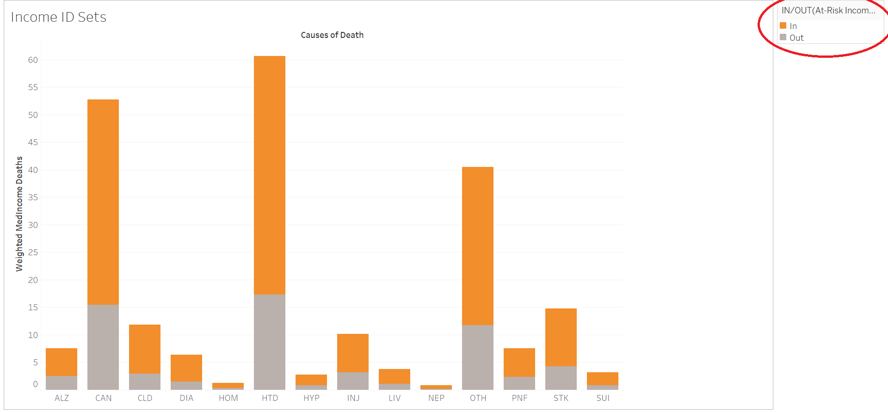
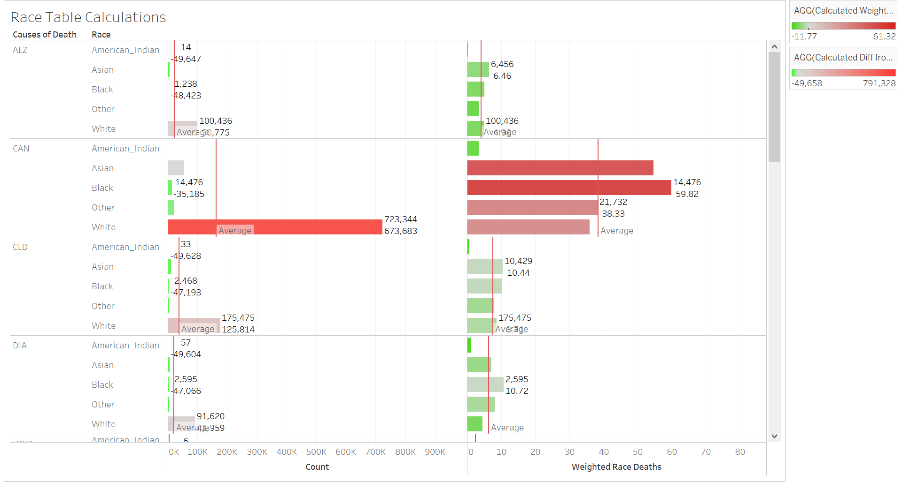

<center></center>

#**Introduction**
Our goal for this porject was to create interesting visualization showing correlations between causes of death and the demographic trends in the zip codes of California. 

In order to do so we are cleaning dirty Zip code data from the US Census and as well as zip code data corresponding to cause of death. These data sets are available on data.world. These data sets are joined using Tableau and R, with which we can produce the visualizations we present in this document.

The following links refer to the census data used for out visualizations.

Median Income data was taken from the following link to the US Census Data in data.world:
https://data.world/uscensusbureau/acs-2015-5-e-income

Median Age data was taken from the following link to the US Census Data in data.world:
https://data.world/uscensusbureau/acs-2015-5-e-agesex

Dominant Race data was taken from the following link to the US Census Data in data.world:
https://data.world/uscensusbureau/acs-2015-5-e-race

#**R Configuration**
Below we display our sessionInfo().

```{r sessionInfo}
sessionInfo(package=NULL)
```

#**Processing the Data**
The csv files containing our data of interest were passed through individual ETL files for cleaning. In this process spaces are included between upper and lower cased letters and ampersands are changed to the word "and".These subtleties among others are done to effectively upload the data files to data.world. Because our data did not require much "cleaning" or renaming of columns, we did not need to include in depth code in the ETL file. We used many "cookie-cutter" ETL files to clean the many files we used for our joins. These files include "ETL_median_age.R, ETL_dominant_race.R, ETL_median_income.R, ETL_export1.R, ETL_export2.R, and ETL_export3.R." Below is a source or link to one of our ETL files. 

```{r echo=FALSE}
 source("../01Data/ETL_dominant_race.R")
```

#**Tableau Visualizations Steps**

##**Boxplot Visualization Steps**

####**Step 1 - Retrieving our Data**
We pulled in 3 data sets from our project that originated from the US Census (median_income.csv, median_age.csv, and dominant_race.csv).We found that some columns in these data sets had to be grouped, so we included our SQL code at the bottom of the project that describes how we created bins for ages, incomes, and dominant races.For this same reason, we did not pull from the Census Bureau's data. Instead, we used the data.world connector to retrieve everything from our final project site on data.world. This is where we also pulled the Cause of Death data set. These files were inner joined on ZIP Code to analyze cause and count of death to median income, dominant race, and median age in each ZIP Code.

####**Step 2 - Boxplot Overview**
In order to create our box plot we set causes of deathas the columns which can be seen along the x-axis of the plot. The row are set as the count of deaths as seen on the y-axis of the plot. Each zip code has a corresponding point on the boxplot for each cause of death. We set dominant race as the color of the points in the plot. Therefore, the color of each point depends on each zip code's dominant race. The boxes along each column mark the 25th to 75th percentile of counts of deaths per zip code for each cause. The whiskers mark the highest and lowest count values considered to not be outliers. 

####**Step 3 - Filter**
We added a filter to this boxplot in order to define the range of the median incomes of the zipcodes displyed. 

##**Histogram Visualization Steps**

##**Scatter Plot Visualization Steps**

##**Crosstab Visualization Steps**

##**Barchart Visualization Steps**

####**Step 1 - Retrieving our Data**
We pulled in 3 data sets from our project that originated from the US Census (median_income.csv, median_age.csv, and dominant_race.csv).We found that some columns in these data sets had to be grouped, so we included our SQL code at the bottom of the project that describes how we created bins for ages, incomes, and dominant races.For this same reason, we did not pull from the Census Bureau's data. Instead, we used the data.world connector to retrieve everything from our project 6 site on data.world. This is where we also pulled the Cause of Death data set. These files were inner joined on ZIP Code to analyze cause and count of death to median income, dominant race, and median age in each ZIP Code.

####**Step 2 - Barchart Overview**
We created barcharts between either median income, dominant race, or median age (one blue) and cause of death (second blue) in the row slot. This then lists all the causes of death and within each cause of death lists a row for either median age, or dominant race.  A sum of the count of deaths (green) was added as the column of the barcharts. With this count we can compare the number of people dying of a certain cause of death across zip codes of different median ages (for example). Nonetheless, we considered that certain races, and ages were over represented in our data. Therefore, we created a calculated field to add to our column slot named Weighted Race/Age Deaths which will be described in the following bullet. This calculated field allows us to recognize which populations are more likely to die of certain causes than predicting from a raw count of deaths.  


####**Step 3 - Calculated Fields**
Furthermore, as mentioned previously we created three calculated field producing a  Weighted count of Deaths for income, age, and dominant race. To illustrate the process we can take the deaths by race barchart as an example. The calculated field takes the count of deaths in a zip code dominanted by a certain race due to a certain cause and divides it by the total count of deaths in zip codes with that dominant race (regardless of cause of death). This calculated field creates a proportion of deaths due to certain causes that accounts for overrepresented races. We can then compare weighted proportions to more accurately predict which zip codes are more likely to have deaths of a certain cause with respect to their dominant race. This same process was followed for median income, and median age. These weighted count of death was added to the columns lot of our barcharts to create a separate barchart next to raw death count columns. The rows were maintained the same and columns were added to represent the weighted count of deaths.
```{r, out.width = "400px"}
knitr::include_graphics("../03Visualizations/CalculatedFields.png")
```


####**Step 4**

#####**Table Caculations**

The two table calculation pills we included in our Tableau file were "Calculated Diff from Avg" and "Calculated Weighted Diff from Avg." Reference lines were also included in our project. This can be seen in the "Race Table Calculations" visualization. In this case, reference lines were used to depict an average count of death by race for each cause of death. 

```{r, out.width = "400px"}
knitr::include_graphics("../03Visualizations/TableCalculations.png")
```
#####**Reference Lines** 

We decided to use an average reference line for all our barcharts. This takes the average death count between different race dominanted zip codes (for eaxmple) for a certain cause of death and creates a representative line along our columns to visualize the average count. In addition, this average line was created for our weighted death count. The average weighted death count across different race dominanted zip codes (for example) was displayed for each cuase of death as a line acorss our columns.

As shown below, reference lines were implemented in the "Age Reference Lines" visualization to depict the the average count of deaths by age group for each cause of death. 95% confidence intervals were also displayed on this visualization to show the reader that the true count of deaths within the actual age groups would fall within the purple highlighted range 95% of the time. 
```{r, out.width = "400px"}

```
#####**Formatting**

Formatting is depicted in our Income ID Sets Bar chart. Because our y-axis units are Income, they are formatted as Currency.   All of these items are depicted in the visualizations below. 
```{r, out.width = "400px"}

```

#####**ID Sets**

In order to use ID sets we defined 'at risk income brackets'. This was done by creating a bar graph listing different median incomes as bins and creating columns with weighted death counts for zipcodes of each median income (irrespective of cause of death). Zipcodes of median incomes with more than seven weighted death counts were categorized as 'at risk'. This is then taken to create another bar graph with causes of death listed as the bins and weighted count of death as the parameter of the height of the bars. By applying our 'at risk' ID Set we divide the bars in to a proportion at risk and a proportion out of risk. Therefore, for each cause of death we can recognize the amount of weighted deaths in zip codes with a weighted count of deaths above the thershold of seven weighted deaths. 

```{r, out.width = "400px"}

```


#**Tableau Visualizations**
####**Visualization Type 1 - BarGraphs**


The following visualizations were created to give an understanding of how our weighted death counts was created and what our calculted field represents.

#####**Weighted Death Count by Race Visualization**
```{r, out.width = "400px"}
knitr::include_graphics("../03Visualizations/WeightedRaceDeaths.png")
```
The upper graph shows count of deaths for each race. However, in some cases, there are more deaths in a certain group simply because there is a larger population within that group. 
The lower graph accounts for that by taking the count of deaths as a percentage of the total population that belongs to its associated group.

#####**Weighted Death Count by Income Visualization**
```{r, out.width = "400px"}
knitr::include_graphics("../03Visualizations/WeightedIncomeDeaths.png")
```

The upper graph shows count of deaths for each income group. However, in some cases, there are more deaths in a certain group simply because there is a larger population within that group. 
The lower graph accounts for that by taking the count of deaths as a percentage of the total population that belongs to its associated group.

#####**Weighted Death Count by Age Visualization**
```{r, out.width = "400px"}
knitr::include_graphics("../03Visualizations/WeightedAgeDeaths.png")
```
The upper graph shows count of deaths for each age group. However, in some cases, there are more deaths in a certain group simply because there is a larger population within that group. 
The lower graph accounts for that by taking the count of deaths as a percentage of the total population that belongs to its associated group.

####**Visualization Type 2 - Bar Charts**

The following barcharts were created with the process descibed in the Tableau visualization steps.  


#####**Dominant Race Barchart**

```{r, out.width = "400px"}

```
```{r, out.width = "400px"}
knitr::include_graphics("../03Visualizations/RaceTableCalculations2.png")
```
```{r, out.width = "400px"}

```
```{r, out.width = "400px"}
knitr::include_graphics("../03Visualizations/RaceTableCalculations4.png")
```

Looking at the tables on the left, which show the unweighted death counts, one would think white people are more likely to die from just about everything. However, this is simply because there are more whites than any other race in the population, meaning they have more deaths.
In order to account for this, we instead visualized race and cause of death using weighted race deaths (see "Created Weighed Race Deaths" tab). This easily allows us to compare how likely different races are to die of a given cause of death.
Our interesting findings is that of the three highest causes of deaths: cancer, heart disease, and "other", blacks are, on average, more likely to die than any other race, taking into account their numbers in the total population.

#####**Median Age Barchart**

```{r, out.width = "400px"}

```
```{r, out.width = "400px"}

```
```{r, out.width = "400px"}

```

Looking at the tables on the left, which show the unweighted death counts, one would think people who make between 30 and 40 thousand dollars per year are more likely to die from just about everything. However, this is simply because there are more people in that income range than any other in the population, meaning they have more deaths.
In order to account for this, we instead visualized race and cause of death using weighted income deaths (see "Created Weighed Income Deaths" tab). This easily allows us to compare how likely people in different income ranges are to die of a given cause of death
Our interesting finding is that heart disease and cancer are the most likely cause of death across all age groups. 
For cancer we can notice that a larger proportion of people in age groups below 50 years are dying of cancer compared to people in age groups of 60 and above.
 

####**Visualization 3 - ID Sets - Income ID - In, Out**

The visualization below uses Sets to depict income brackets that are either "at-risk"" or not "at-risk." In this case, "at-risk" refers to income brakcets that have a weighted death rate of 7 or more. The orange portions of each bar show the amount of deaths within the "at-risk income brackets" set. The grey portions are those out of the set, as their weighted death rate is below 7.

```{r, out.width = "400px"}
knitr::include_graphics("../03Visualizations/IncomeIDSets-In-Out.png")
```
In order to create the set, we selected the income brackets that had a weighted income death rate greater than 7. These were included in the "In" set.

#**Shiny Visualization Steps**
Link: https://anandpant.shinyapps.io/project_6/

The shiny app creates a barchart using causes of death and either median income, median age, or dominant race. This data is brought in from the data.world files which join census data to the causes of death files. This is created with an inner join on the zip code in both files. The SQL to join is found in the server code for our shiny aplication. 

The user should click on the get data button. This button sends a SQL query to data.world to join and bring in  the data set mentioned above. 

The returned data set will be used with ggplot code to create barcharts that show the count of deaths. The rows of the barcharts list the different Causes of Deaths and the different barcharts depict different age groups (for example). Each of the barcharts have a reference line to show the average count of deaths in that age group.

####**Step 1**
Navigate to 02 Shiny and open Server.R

####**Step 2**
Click publish.

####**Step 3**
Choose either age, race, or income in the sidebar menu.  

####**Step 4**
Select get data. The barchart will be created. You can view the barchart by clicking barchart tab.


#**Shiny Visualizations**
####**Shiny - Data Tab**

The image below shows the data tab panel. Using the query from the server file, this tab is used to display the joined information pulled in from data.world. This data is used to create a barchart. The image below shows the data table for median age, the same is created from median income, and dominant race. 

```{r, out.width = "400px"}
knitr::include_graphics("../03Visualizations/GetDataShiny.png")
```


####**Shiny -  Median Age Bar Chart**

This screeen shot shows the barchart tab pannel using the data pulled in from data.world. The horizontal bars represent counts of death. The rows are grouped by median age, therefore each set of bars corresponds to zip codes of specific median age. Within each grouped median age, the count of death is grouped by cause of death. Therefore each bar represents the count of deaths due to a specific cause within zip codes of a certain median age. In addition, a reference line is added for each group of counts of a median age. This reference line marks the average count of deaths due to a cause of death in zip codes with a certain median age. The numbers next to the bars represent the difference in count due to a cause of death compared to the average amount of deaths per cause. 

The same is created for median income, and dominant race.

We find out from this data that heart disease and cancer caused more deaths than the average cause in all zip codes regardless of median age.


```{r, out.width = "400px"}
knitr::include_graphics("../03Visualizations/BarChartShiny.png")
```


####**Shiny -  Median Income Bar Chart**
This image shows the barchart created from grouping zip codes by median income.

From the refernce line we can note that the count of deaths by suicide has a tendency to grow closer to the average as median income increases.


```{r, out.width = "400px"}
knitr::include_graphics("../03Visualizations/IncomeShiny.png")
```


####**Shiny -  Dominant Race Bar Chart Finding**

This image shows the barchart created from grouping zip codes by dominant race.

From this barchart we find out that only american indian dominated zip codes suffered deaths due to injuries above the average count of deaths due to a cause. All other races had deaths due to injury below the cause death average.

```{r, out.width = "400px"}
knitr::include_graphics("../03Visualizations/RaceShiny.png")
```

#**Key for Causes of Death Abbreviations**
Cause-of-death were coded using the Tenth Revision of the International Classification of Diseases codes (ICD-10). This is in the same data.world profile (@health) that we retrieved our data for the count of deaths by causes from.

* HTD - Diseases of the Heart
* CAN - Malignant Neoplasms (Cancers)
* STK - Cerebrovascular Disease (Stroke)
* CLD - Chronic Lower Respiratory Disease (CLRD)
* INJ - Unintentional Injuries
* PNF - Pneumonia and Influenza
* DIA - Diabetes Mellitus
* ALZ - Alzheimer's Disease
* LIV - Chronic Liver Disease and Cirrhosis
* SUI - Intentional Self Harm (Suicide)
* HYP - Essential Hypertension and Hypertensive Renal Disease
* HOM - Homicide
* NEP - Nephritis, Nephrotic Syndrome and Nephrosis
* OTH - All Other Causes of Death

#**SQL Query for Grouping and Joining data**
####**Dominant Race Query and join**

#####**THIS WAS USED FOR CROSSTAB 1 IN OUR SHINY APP**

#####Creating bins in dominantRace.csv

The following query is an example of how the census data was processed to define the dominant race in a zip code. The same process followed to define median income and median age in each zip code analyzed. 

select ZCTA as ZipCode,
 	CASE
 	    WHEN B02008_001 >=  B02009_001 AND B02008_001 >=  B02010_001 AND B02008_001 >=  B02011_001 AND B02008_001 >=  B02012_001 AND B02008_001 >=  B02013_001 THEN "White"
 		WHEN B02009_001 >=  B02008_001 AND B02009_001 >=  B02010_001 AND B02009_001 >=  B02011_001 AND B02009_001 >=  B02012_001 AND B02009_001 >=  B02013_001 THEN "Black"
 		WHEN B02010_001 >=  B02008_001 AND B02010_001 >=  B02009_001 AND B02010_001 >=  B02011_001 AND B02010_001 >=  B02012_001 AND B02010_001 >=  B02013_001 THEN "American_Indian"
 		WHEN B02011_001 >=  B02008_001 AND B02011_001 >=  B02009_001 AND B02011_001 >=  B02010_001 AND B02011_001 >=  B02012_001 AND B02011_001 >=  B02013_001 THEN "Asian"
 		WHEN B02012_001 >=  B02008_001 AND B02012_001 >=  B02009_001 AND B02012_001 >=  B02010_001 AND B02012_001 >=  B02011_001 AND B02012_001 >=  B02013_001 THEN "Native_Hawaiian"
 		WHEN B02013_001 >=  B02008_001 AND B02013_001 >=  B02009_001 AND B02013_001 >=  B02010_001 AND B02013_001 >=  B02011_001 AND B02013_001 >=  B02012_001 THEN "Other"
 	end AS Dominant
 	from USA_ZCTA
 where B02008_001 is not null AND B02009_001 is not null AND B02010_001 is not null AND B02011_001 is not null AND B02012_001 is not null AND B02013_001 is not null
 

The rest of the queries that helped us create bins can be found at "../01Data/commands.sql"
