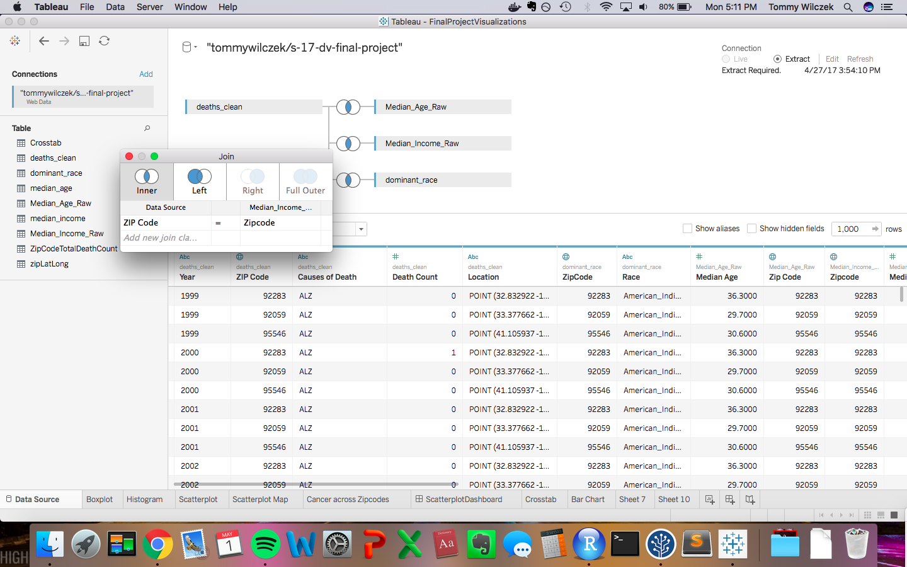

<center></center>

#**Introduction**
Our goal for this porject was to create interesting visualization showing correlations between causes of death and the demographic trends in the zip codes of California. 

In order to do so we are cleaning dirty Zip code data from the US Census and as well as zip code data corresponding to cause of death. These data sets are available on data.world. These data sets are joined using Tableau and R, with which we can produce the visualizations we present in this document.

The following links refer to the census data used for out visualizations.

Median Income data was taken from the following link to the US Census Data in data.world:
https://data.world/uscensusbureau/acs-2015-5-e-income

Median Age data was taken from the following link to the US Census Data in data.world:
https://data.world/uscensusbureau/acs-2015-5-e-agesex

Dominant Race data was taken from the following link to the US Census Data in data.world:
https://data.world/uscensusbureau/acs-2015-5-e-race

#**R Configuration**
Below we display our sessionInfo().

```{r sessionInfo}
sessionInfo(package=NULL)
```

#**Data Summary**
The follwoing heads and summaries demonstrate the data that will be joined via data.world in our queries when using shiny. This data will also be joined in tableau for the corresponding visualizations.  

```{r echo=FALSE}
summary(df) 
head(df)
```

```{r echo=FALSE}
summary(deaths) 
head(deaths)
```

#**Processing the Data**
The csv files containing our data of interest were passed through individual ETL files for cleaning. In this process spaces are included between upper and lower cased letters and ampersands are changed to the word "and".These subtleties among others are done to effectively upload the data files to data.world. Because our data did not require much "cleaning" or renaming of columns, we did not need to include in depth code in the ETL file. We used many "cookie-cutter" ETL files to clean the many files we used for our joins. These files include "ETL_median_age.R, ETL_dominant_race.R, ETL_median_income.R, ETL_export1.R, ETL_export2.R, and ETL_export3.R." Below is a source or link to one of our ETL files. 

Below is a source of our etl file used to clean our dominant race file,
```{r echo=FALSE}
 source("../01Data/ETL_dominant_race.R")
```

The following screen shot shows some of the code used to clean the dominant race file.
```{r, out.width = "400px"}
knitr::include_graphics("../01Data/dominantRace.png")
```


#**Tableau Visualizations Steps**

##**Retrieving our Data**
We pulled in 3 grouped data sets from our project that originated from the US Census (Median_Income_Raw.csv, and Median_Age_Raw.csv). In addition, we grouped a set from race deomgraphics Census data to create the domianat_race.csv. In order to create this file, we queried the orginal census data in a way we could define the domianant race in each zip code.A new column was added to the data set indicating the most represented race in each zip code. We used the data.world connector to retrieve everything from our final project site on data.world. This is where we also pulled the Cause of Death data set. These files were inner joined on ZIP Code to analyze cause and count of death to median income, dominant race, and median age in each ZIP Code.

```{r, out.width = "400px"}

```

##**Boxplot Visualization Steps**

####**Step 1 - Boxplot Overview**
In order to create our box plot we set causes of death as the columns which can be seen along the x-axis of the plot. The row are set as the count of deaths as seen on the y-axis of the plot. Each zip code has a corresponding point on the boxplot for each cause of death. We set dominant race as the color of the points in the plot. Therefore, the color of each point depends on each zip code's dominant race. The boxes along each column mark the 25th to 75th percentile of counts of deaths per zip code for each cause. The whiskers mark the highest and lowest count values considered to not be outliers. 

####**Step 2 - Filter**
We added a filter to this boxplot in order to define the range of the median incomes of the zipcodes displyed. 

```{r, out.width = "400px"}

knitr::include_graphics("../03Visualizations/Boxplot2.png")
knitr::include_graphics("../03Visualizations/Boxplot3.png")


```


<center></center>

##**Histogram Visualization Steps**

####**Step 1 - Histogram Overview**
For this plot we set our column as median household income and columns to count of people in the corresponding income. Therefore, each bar represents the count of people living in zip codes binned to corresponding median incomes. In addition, dominant race was added as a color to represent the count of people in that binned median income of zip codes of each dominant race. 

####**Step 2 - Filter**
For this plot race was set as a filter. The user can then filter which dominant race zip codes should be displayed in the binned population count.


```{r, out.width = "400px"}


```

##**Scatter Plot Visualization Steps**

####**Step 1 -Scatter Plot Overview**
In order to create our scatter plot we set our columns as our zip code median age and the rows as the count of deaths. Each point represents the count of deaths in a particular zip code. Color was added to these points to represent the dominant race in each zip code. 

####**Step 2 -Pages**
Pages were added to the visualization with respect to cause of death. Each page then only shows the count of deaths due to a specific cause for each zip code.

####**Step 3 -Scatter Plot Map**
Based on this data a map was created in a separate sheet. Points in the state of California correspond to the zip codes sampled. The size of the points correspond to the median income of each zip code.The color of each point corresponds to the most represented race in each zip code.

####**Step 4 -Zip Code Lines Map**
In addition, another map was reproduced in a different sheet dividing the state of california by zip code lines. Death count is represented as the color of the area of each zip code. A filter was created to only display zip codes with a the chosen range of deaths. From this map we note that the zip code with most deaths due to cancer is located in NAPA valley. This location is known for mass farming. We would be intrested in knowing if pesticides used in the area could account for the highest cancer rates seen in the state of California.

####**Step 3 -Actions**
Both maps produced were set as a target sheets which can filter to only show zip codes displayed in the chosen page in the scatter plot sheet. Therefore, only zip codes affected by a certain cause of deaths will be displayed in the map if the corresponding cause is the selected page.

```{r, out.width = "400px"}
knitr::include_graphics("../03Visualizations/Tableau_Screenshots/3.png")


```

##**Crosstab Visualization Steps**

####**Step 1 - Crosstab Overview**
In order to create our crosstab we set race as our columns and cause of death as our rows. Text then was added in the cells as count of deaths pertaining to the cell. Each cell then contains the count of deaths for zip codes with a certain dominant race due to a certain cause. The color of the text as set as our KPI which is decribed in the next step.

####**Step 2 - Calculated field: Average deaths per zip code**
For our key preformance indicator we chose to divide the count found in the crosstab cells by the number of zipcodes accounting for the count. This give the averge count of deaths due to a certain cause per zip code of a certain dominant race. The color of the text in each cell corresponds to the avergae deaths per zip code in that cell.

```{r, out.width = "400px"}


```

##**Barchart Visualization Steps**

####**Step 1 - Barchart Overview**
We created barcharts between median age (one blue) and cause of death (second blue) in the columns slot. This then lists all the causes of death and within each cause of death lists the median age bins we created   The KPI- average deaths per zip code (green) was added as the row of the barcharts. With this average count we can compare the average number of people dying per zip code of a certain cause of death across zip codes of different median ages. This was done cosidering that certain median incomes were over represented in our data. Therefore the bars of our barchart represent the average count of deaths perzip code due to a certain cause in zip codes of a certain median income.

####**Step 2 - Calculated Field: Average deaths per zip code**
As mentioned, the calculated field used was average deaths per zip code. This takes the count of deaths and divides it by the number of zip codes represented.

####**Step 3 - Reference Line**
The parameter represented by reference lines takes the average of the averages of deaths per zip code across different median incomes due to the same cause of death. Therefore, one reference line is assigned to each cause of death to represent this parameter.

####**Step 4 - Table Calculations**
The table calculation takes the calculated average used as the parameter for our refernce line and subtracts this number from the average counts in each bar(resulting in a difference for each median income). This calculation is refered to as the difference from the average.

```{r, out.width = "400px"}
knitr::include_graphics("../03Visualizations/Tableau_Screenshots/7.png")
knitr::include_graphics("../03Visualizations/Tableau_Screenshots/8.png")
knitr::include_graphics("../03Visualizations/Tableau_Screenshots/9.png")

```


#**Shiny Visualization Steps**
Link: https://anandpant.shinyapps.io/project_final/

The shiny app creates plots using queries set to bring in data of interest from data.world. In these queries Census data is joined to the causes of death files. This is created with an inner join on the zip code in both files. The SQL to join is found in the server code for our shiny aplication. 

The user should click on the get data button. This button sends a SQL query to data.world to join and bring in  the data set mentioned above. 

The returned data set will be used by ggplot code to create the different visualizations shown below. 

####**Step 1**
Navigate to 02 Shiny and open Server.R

####**Step 2**
Click publish.

####**Step 3**
Choose either age, race, or income in the sidebar menu.  

####**Step 4**
Select get data. The barchart will be created. You can view the barchart by clicking barchart tab.


#**Shiny Visualizations**

####**Shiny - Data Tab**
The image below shows the data tab panel. This is found in ever tab in our application. It displays the data we use in our visualization in a tabulated format. This data is the data we query from data.world which is queried upon selecting the get data button.

####** Boxplot Tab**
In order to create our box plot we set causes of death as  the x-axis of the plot. The y axis is set as the count of deaths. Each set of zip code for each dominant race has a corresponding box and whisker plot for each case of death. We set dominant race as the color of the boxes in the plot. The boxes along each column mark the 25th to 75th percentile of counts of deaths per zip code for each cause. The whiskers mark the highest and lowest count values considered to not be outliers. From this plot we notice heart disease accounts for the highest counts of deaths for all races.
We added a filter to this boxplot which will plot according to data from zip codes within the chosen range of death counts. 

```{r, out.width = "400px"}
knitr::include_graphics("../03Visualizations/Shiny_Screenshots/gettingdata1.png")
knitr::include_graphics("../03Visualizations/Shiny_Screenshots/plot1.png")
```

####**Histogram Tab**
The histogram displayed is created by grouping zip codes of different median ages to bins with ranges of 5 years. The zip codes corresponding to the median ages assigned by each zip code have their count of deaths summed and displayed as the columns of the plot.

```{r, out.width = "400px"}
knitr::include_graphics("../03Visualizations/Shiny_Screenshots/gettingdata2.png")

```

####**Scatter Plot Tab**
The scatter plot created has a point corresponding to the count of deaths of each cause per zip code. These points are organized along the x axis by their median age and placed along the y axis by their count of deaths. The color each point is assigned by the cause of death the count represents. From the plot we can make the observation that median age of zip codes are normally distributed about age. This can be noted by the larger count of deaths in the middle of the plot since most zip codes have middle aged median age zip codes.Less deaths occur in the highest a lowest median age zip codes. 
The increase in count of deaths around median age of 40 can be explained by the increased risk for heart disease seen in males over the age of 45. High numbers of over 45 year olf males may account for the rise in deaths.

```{r, out.width = "400px"}
knitr::include_graphics("../03Visualizations/Shiny_Screenshots/gettingdata3.png")
knitr::include_graphics("../03Visualizations/Shiny_Screenshots/plot3.png")

```

####**Crosstab Tab**
The cross tab created has causes of death labled on the y-axis and dominant race in the x-axis. Each cell then displayed the sum of the count of deaths in the zip codes with a certain dominant race due to a certain cuase. In addition, before retrieving the data, users can define the ranges corresponding to a low, medium, and high KPI using the sliders in the data tab. The KPI we created was average deaths per zip code. This KPI takes the sum of the counts as displayed in the cells and divides that by the number of zip codes taken in to account in the sum of the counts. This definition of high, low and medium average deaths per zip codes is taken by the query sent to data.world. The query returns a column in the data defining whether a cause of death and dominant race combination has a high, low or medium average deaths per zip code. This parameter is then used to color the cells in the crosstab with its corresponding level of average deaths.  

From this plot we notice heart disease accounted for more deaths per zip code for all races when compared to deaths due to cancer. This leads us to believe that genetic links to heart disease are less relevant as opposed to the health habits of all people regradless of race.

We also notice that only whites and american indian dominated zip codes suffered deaths due to injury in the same order of magnitude as their corresponding deaths due to heart diesease. The same cannot be said about the rest of the races.

```{r, out.width = "400px"}
knitr::include_graphics("../03Visualizations/Shiny_Screenshots/gettingdata4.png")

```

####**Bar Chart Tab**
For our barchart, median age zip codes were grouped together. These groupings were then each divided by cause of death as seen in the y axis. The length of the bars account for the average death count per zip code for a certain cause of death in zip codes of a certain median age range. In addition a reference line was added to each median age grouping. This line indicates the average of the average deaths per zip codes in each grouping. The numbers labeled next to the bars correspond to the average of the average death count per zip code. From this plot we notice average deaths per zip code due to injury doubles when moving from zip codes from ages 60-70 to zip codes with median ages 70-80.  

```{r, out.width = "400px"}
knitr::include_graphics("../03Visualizations/Shiny_Screenshots/gettingdata5.png")

knitr::include_graphics("../03Visualizations/Shiny_Screenshots/plot6.png")
knitr::include_graphics("../03Visualizations/Shiny_Screenshots/plot6.1.png")

```

#**Key for Causes of Death Abbreviations**
Cause-of-death were coded using the Tenth Revision of the International Classification of Diseases codes (ICD-10). This is in the same data.world profile (@health) that we retrieved our data for the count of deaths by causes from.

* HTD - Diseases of the Heart
* CAN - Malignant Neoplasms (Cancers)
* STK - Cerebrovascular Disease (Stroke)
* CLD - Chronic Lower Respiratory Disease (CLRD)
* INJ - Unintentional Injuries
* PNF - Pneumonia and Influenza
* DIA - Diabetes Mellitus
* ALZ - Alzheimer's Disease
* LIV - Chronic Liver Disease and Cirrhosis
* SUI - Intentional Self Harm (Suicide)
* HYP - Essential Hypertension and Hypertensive Renal Disease
* HOM - Homicide
* NEP - Nephritis, Nephrotic Syndrome and Nephrosis
* OTH - All Other Causes of Death

#**SQL Query for Grouping and Joining data**
####**Dominant Race Query and join**

#####**THIS WAS USED FOR CROSSTAB 1 IN OUR SHINY APP**

#####Creating bins in dominantRace.csv

The following query is an example of how the census data was processed to define the dominant race in a zip code. The same process followed to define median income and median age in each zip code analyzed. 

select ZCTA as ZipCode,
 	CASE
 	    WHEN B02008_001 >=  B02009_001 AND B02008_001 >=  B02010_001 AND B02008_001 >=  B02011_001 AND B02008_001 >=  B02012_001 AND B02008_001 >=  B02013_001 THEN "White"
 		WHEN B02009_001 >=  B02008_001 AND B02009_001 >=  B02010_001 AND B02009_001 >=  B02011_001 AND B02009_001 >=  B02012_001 AND B02009_001 >=  B02013_001 THEN "Black"
 		WHEN B02010_001 >=  B02008_001 AND B02010_001 >=  B02009_001 AND B02010_001 >=  B02011_001 AND B02010_001 >=  B02012_001 AND B02010_001 >=  B02013_001 THEN "American_Indian"
 		WHEN B02011_001 >=  B02008_001 AND B02011_001 >=  B02009_001 AND B02011_001 >=  B02010_001 AND B02011_001 >=  B02012_001 AND B02011_001 >=  B02013_001 THEN "Asian"
 		WHEN B02012_001 >=  B02008_001 AND B02012_001 >=  B02009_001 AND B02012_001 >=  B02010_001 AND B02012_001 >=  B02011_001 AND B02012_001 >=  B02013_001 THEN "Native_Hawaiian"
 		WHEN B02013_001 >=  B02008_001 AND B02013_001 >=  B02009_001 AND B02013_001 >=  B02010_001 AND B02013_001 >=  B02011_001 AND B02013_001 >=  B02012_001 THEN "Other"
 	end AS Dominant
 	from USA_ZCTA
 where B02008_001 is not null AND B02009_001 is not null AND B02010_001 is not null AND B02011_001 is not null AND B02012_001 is not null AND B02013_001 is not null
 

The rest of the queries that helped us create bins can be found at "../01Data/commands.sql"
